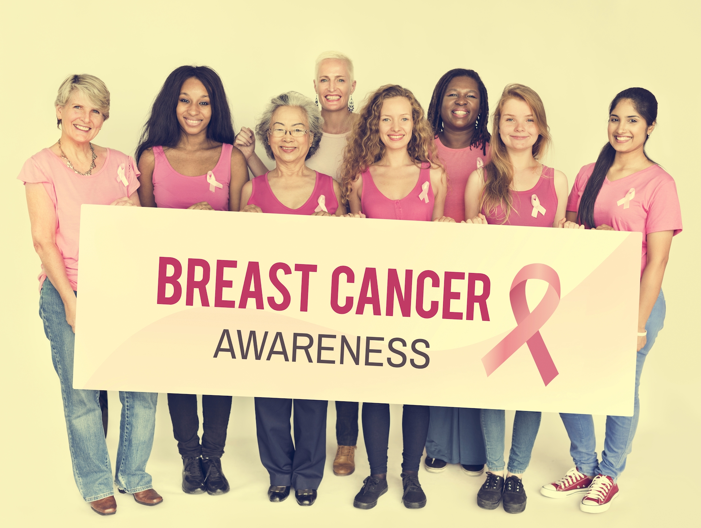

## О проекте

Информационный ресурс, посвященный борьбе с раком молочной железы (РМЖ или раке груди) в Беларуси и не только.

Проект разработан силами участников хакатона "Hack for Pink", проводимого в рамках ежегодного гобального месячника по борьбе с раком молочной железы, инициированного группой компаний Estée Lauder.

Наша цель - сделать так, чтобы регулярная само- и профессиональная диагностика и скрининг рака молочной железы вошла в привычку и навсегда закрепилась в календарях у женщин. 

## Связаться с нами

Связаться с нами можно
* через email _info@pobedim.by_
* написав в личные сообщения любому из [участников проекта](https://github.com/Pink-Ribbon/pobedimby/graphs/contributors) на GitHub.
* открыв [issue (тикет) с вопросом, проблемой или предложением](https://github.com/Pink-Ribbon/pobedimby/issues) в репозитории проекта на GitHub. Нажмите на кнопку _New Issue_ для создания тикета.

## Предложить помощь проекту

Этот проект поддерживается исключительно на волонтерских началах. Принять участие в его развитии может любой человек и для этого не нужно никаких специальных навыков и совсем немного времени. Вот что можно делать:
* Находить, переводить и размещать статьи и материалы, ссылки и референсы на оригинальные источники
* Модерировать разделы "Врачи" и "Клиники"
* Устанавливать партнерские связи с другими ресурсами и проектами по тематике женского здоровья, борьбы с раковыми заболеваниями и т.п.
* Принимать участие в раскрутке, продвижении проекта
* Помогать с технической стороной сайта - дизайн и верстка сайтов и разделов, разработка нового функционала

Вместе мы сможем победить рак молочной железы!

