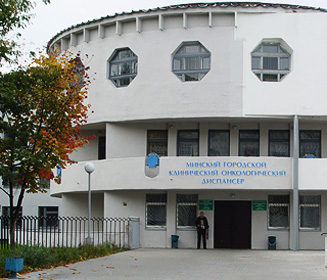

## Внешние ресурсы для поиска клиник

[Список поликлиник Беларуси - портал 103.by](https://www.103.by/cat/med/polikliniki/)

[Список клиник Беларуси - портал doktora.by](https://doktora.by/clinics)

[Список клиник оказывающих частные услуги мамологов Беларуси - портал 103.by](https://www.103.by/cat/medcentry/mammologiya)

## Ведущие клиники Беларуси 
### [Республиканский научно-практический центр онкологии и медицинской радиологии имени Н.Н. Александрова](https://omr.by/)

Крупнейший центр онкологии Беларуси. Опыт работы по диагностике и лечению более 55 лет. Время работы с 8:00 до 16:30 (Пн.- Пт.)
Адрес: Республика Беларусь, аг. Лесной, Минский район, Минская область
Контакты: +375 (17) 389-99-00,  +375 (17) 389-99-10

### [Минский городской клинический онкологический диспансер](http://www.mgkod.by/)

Специализированное онкологическое учреждение Республики Беларусь, осуществляющее диагностику, хирургическое, комбинированное и комплексное лечение больных с опухолями различных локализаций, а также их диспансерное наблюдение и реабилитацию.
Адрес: г. Минск, пр-т Независимости, 64
Контакты: +375 17 237-32-90

### [Брестский областной онкологический диспансер](https://www.oncology.brest.by/)

УЗ "Брестский областной онкологический диспансер» является ведущим онкологическим учреждением Брестской области, оказывающим помощь пациентам с онкологическими заболеваниями.
Адрес: г. Брест, ул. Медицинская 6.
Контакты: +375 162 97-76-74

### [Витебский областной онкологический диспансер](https://onco.by/)

Витебский областной клинический онкологический диспансер - это главное специализированное многопрофильное лечебно-профилактическое учреждение Витебский области, основной задачей которого является организация и оказание онкологической помощи населению.
Адрес: Витебск, ул. П.Бровки, 33
Контакты: +375 (212) 33 00 46, +375 (212) 33 00 39, +375 (212) 57 24 01

### [Гомельский Областной Клинический Онкологический Диспансер](https://www.grcoc.gomel.by/)

Одно из ведущих клинических учреждений Гомельской области, проводит специализированное лечение онкологических больных. Широко использует комбинированное и комплексное лечение, которое включает использование химиотерапии и лучевой терапии
Адрес: г. Гомель, ул. Медицинская, 2 
Контакты:: 8 (0232) 50-42-66, 8 (0232) 49-19-45, 8 (0232) 49-19-37

### [Поликлиника УЗ Областной Онкологический Диспансер Гродно](http://gocb.by/medical-service/oncology-center.html/)

Структурное подразделение УЗ "Гродненская университетская клиника" является ведущим онкологическим учреждением Гродненской области, оказывающим помощь пациентам с онкологическими заболеваниями.
Адрес: Гродно, Бульвар Ленинского комсомола, 52
Контакты: 8 (0152) 433772 

### [Могилевский областной онкологический диспансер](http://mood.by/)

Могилевский областной онкологический диспансер - ведущее онкологическое учреждение Могилевский области. Оказывает помощь пациентам с всеми онкологическими заболеваниями.
Адрес: г. Могилев, ул. Академика Павлова, 2А, 
Контакты: 8(0222) 65-50-20, 8(0222) 65-50-30, 8(0222) 65-50-40
