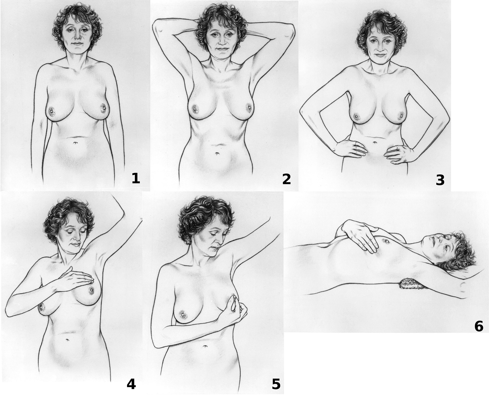

## Самодиагностика

Самообследование молочных желез каждый месяц в один и тот же период менструального цикла – лучше на 5-8 день после окончания менструации. В эту фазу цикла железа максимально расслаблена и обследование будет более точным. В случае наступления климакса можно проводить осмотр в любой календарный день.

_Схема выполнения самостоятельного обследования молочной железы в 6 этапов. Этапы 1-3 включают осмотр груди с руками по бокам, над головой и отведёнными в сторону. Этап 4 — ощупывание молочной железы. Этап 5 — ощупывание соска. Этап 6 — ощупывание молочной железы лёжа._

Эти симптомы могут послужить поводом обратиться за профессиональной диагностикой:

* изменение формы груди
* асимметрия молочных желез
* увеличение / уменьшение груди
* сыпь, покраснение на коже
* язвы и опрелости под грудью
* втягивания сосков и потемнение альвеолы
* трещины на сосках
* увеличение подмышечных лимфоузлов
* выделения из сосков (не в период лактации)
* узлы, уплотнения в молочной железе

## Профессиональная диагностика 

Диагностика рака молочной железы начинается с осмотра у врача-маммолога. Врач проверяет ткани молочной железы, лимфатические узлы подмышками и в области ключиц на наличие уплотнений или других отклонений от нормы. После этого определяется дальнейший план инструментального обследования, который индивидуален для каждой пациентки.

Молодым женщинам рекомендуется УЗИ молочных желез. Женщинам старше 40 лет – дополнительно показана маммография. Использование УЗИ после 50 лет неинформативно. Выбор между УЗИ и маммографией для каждой пациентки выполняется с учетом множества параметров – количества детей, продолжительности грудного вскармливания и т.д. Иногда может быть назначена магнитно-резонансная томография (МРТ) молочных желез (например, женщине молодого возраста с высоким риском рака).

Если пальпаторно, на УЗИ или маммографии обнаружены подозрительные очаги, проводится биопсия – забор образцов ткани. Современная медицина позволяет выполнить манипуляцию под контролем УЗИ, рентгена или МРТ, что повышает ее точность и безопасность. Биопсия делается под местным обезболиванием и занимает немного времени. В Универсальной клинике «Оберіг» используется BARD-система для правильного забора толстой иглой, которая обеспечивает 100% точность результата.

Биоптат отправляется в патогистологическую лабораторию, чтобы определить, является ли новообразование злокачественным. Образец ткани также используется для определения типа раковых клеток, отличий по структуре от нормальных клеток (степени дифференцировки). Иммуногистохимическое исследование позволяет обнаружить наличие гормональных рецепторов (к эстрогену, прогестерону) или белка HER2, и, следственно, определить чувствительность заболевания к различным видам лечения.